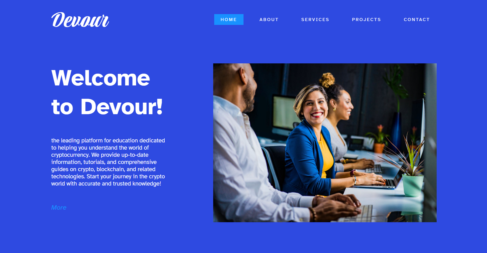
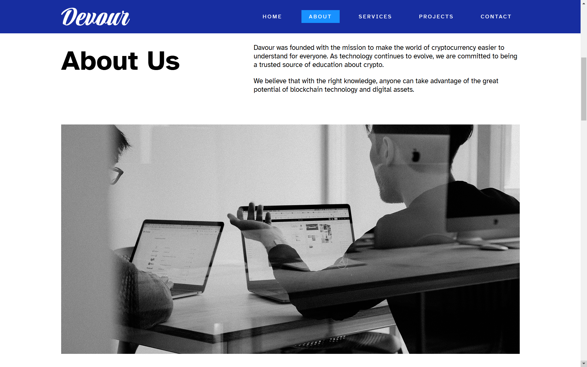
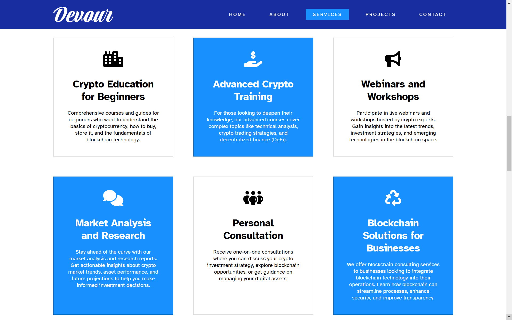
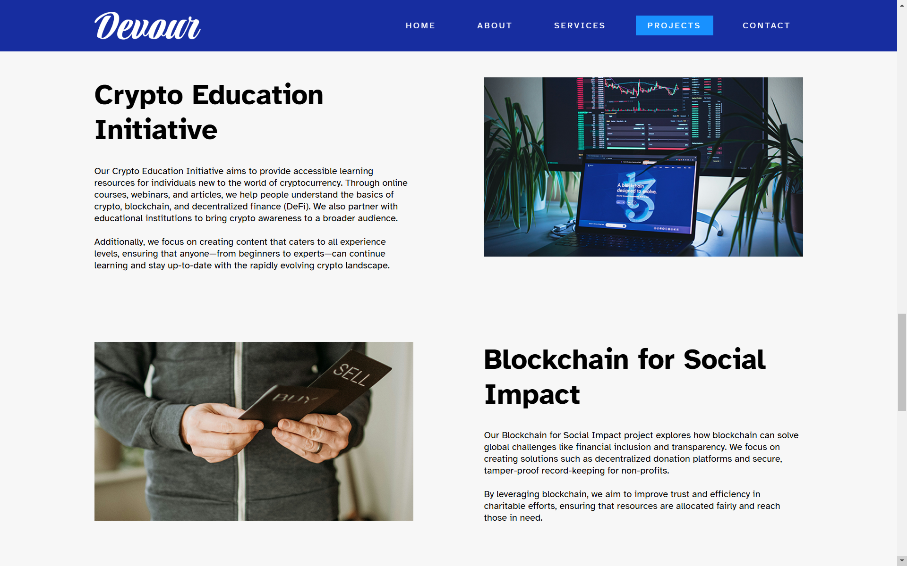

# Rizkiyul Website

You can access this website it at: [Devour](https://lf3tthyxhhtgyrw3rpv3wmro4csa3jrrcid4eo26sg7ltzkk6kmq.arweave.net/WXc5nxc55mxG24vruzIu4KQNpjESB8I7XpG-ueVK8pk/)

## Screenshots Website Menu

## Description

Devour is the leading platform for education dedicated to helping you understand the world of cryptocurrency. We provide up-to-date information, tutorials, and comprehensive guides on crypto, blockchain, and related technologies. Start your journey in the crypto world with accurate and trusted knowledge! 

this website deploy use [Dragondeploy](https://dragondeploy.xyz/)

## Project Structure

- `style.css`: Styles for the website.
- `style-global.css`: Styles for the website.
- `style-responsive.css`: Styles for the website.
- `images/`: Contains images used in the website.
- `js/`: Javascript of Website.
- `form/`: Form table for Website.
- `font/`: Font for Website.
- `index.html`: Home page/About/Service/Project/Contact.

## Deploying to Dragondeploy

### 1. Preparing Your Project

before your deploy check your project, make sure you have the following files and folders in your project directory. after that
you can visiting the [Dragondeploy](https://dragondeploy.xyz/)

### 2. Connecting and Setting Permision Wallet

Before your upload file project you should configure permision.
you can visiting [Setting Permision](https://dragondeploy.xyz/pro-tips)

### 3. Uploading Your Files

Drag and drop your project folder directly into DragonDeploy and verification your project with your wallet. Press accept to confirm the project. and then when it is finished, a link will appear to access your project.

Good luck Bang !!